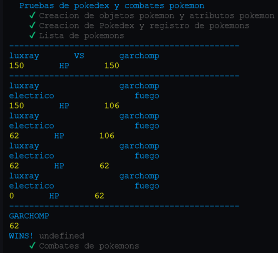
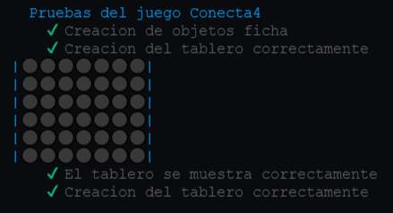

# Práctica 5 - DSI
## Clases


### Índice de ejercicios

-[Ejercicio 1  - Pokedex](#e1) 
-[Ejercicio 2 - Conecta4](#e2) 


### Introducción

En este nuevo proyecto, emplearemos un desarrollo dirigido por pruebas (TDD) y estará documentado, para lo 
que vamos a valernos de tres herramientas para llevarlo a cabo:

* [Mocha](https://mochajs.org/) y [Chai](https://www.chaijs.com/): para incorporar TDD.
* [Typedoc](https://typedoc.org/): para realizar la documentación automática de nuestro codigo.
* [Instambul][https://istanbul.js.org/] Para mostrarnos los datos de cubrimiento de nuestros test.
* [Coveralls](https://coveralls.io/) Para llevar el seguimiento de `Instambul` en nuestro repositorio.

Continuaremos con la misma estructura de directorios basada en las anteriores prácticas, añadiendo el nuevo
directorio `test` para alojar las expectativas del código y `Typedocumentation` para almacenar la
documentación generada por `Typedoc`.

Con todo esto implementaremos 10 funciones propuestas, repasando conceptos sobre los apartados vistos en 
clase:
* [Creación de un proyecto inicial con Typescript](https://ull-esit-inf-dsi-2122.github.io/typescript-theory/typescript-project-setup.html)
* [Tipos de datos estáticos](https://ull-esit-inf-dsi-2122.github.io/typescript-theory/typescript-static-types.html)
* [Funciones](https://ull-esit-inf-dsi-2122.github.io/typescript-theory/typescript-functions.html)
* [Arrays, tuplas y enumerados](https://ull-esit-inf-dsi-2122.github.io/typescript-theory/typescript-arrays-tuples-enums.html)
* [Objetos, clases e interfaces](https://ull-esit-inf-dsi-2122.github.io/typescript-theory/typescript-objects-classes-interfaces.html)

<a name="e1"></a>
## Ejercicio 1 - Pokedex 

Crearemos una clase para registrar diferentes pokemons, para representar la informacion de cada uno definimos
la siguiente clase `Pokemon`: 

```Typescript
export class Pokemon {
  constructor(
    public nombre: string,
    public tipo: type,
    public peso: number,
    public altura: number,
    public ataque: number,
    public defensa: number,
    public velocidad: number,
    public vida: number){}
  
  showStatus(){
    console.log(this.nombre.toUpperCase()), ' : ', this.tipo;
    console.log(this.vida);
  }
}
```

Que representa los datos necesarios pada cada Pokemon.

La clase Pokedex consistira en un array de estos objetos y un metodo que determinara si un pokemon esta registrado
o no:

```Typescript
export class Pokedex {
  public list: Pokemon[];
  constructor(l: Pokemon[]){
    this.list = l;
  }
  isRegistered(p: Pokemon): boolean {
    return this.list.includes(p);
  }
}
```

Por último, desarrollamos la clase `Combat` que representa un combate entre dos pokemons registrados, aprovechando
la funcion en un ejercicio anterior sobre `Pokemons`. Revisaremos la clase por partes:
  
`Constructor` Recibe los pokemons
```Typescript

export class Combat {
  constructor(private p1: Pokemon, private p2: Pokemon){}
```

`Daño real` El metodo reutilizado que ya explicamos en la practica 4.
```Typescript
dañoReal(p1: Pokemon, p2: Pokemon) {
    let efectividad: number = 0;
    const fuerteContraAgua: type[] = ['hierba', 'electrico'];
    const debilContraAgua: type[] = ['fuego'];

    const fuerteContraFuego: type[] = ['agua'];
    const debilContraFuego: type[] = ['hierba'];

    const fuerteContraElectrico: type[] = [];
    const debilContraElectrico: type[] = ['agua'];

    const fuerteContraHierba: type[] = ['fuego'];
    const debilContraHierba: type[] = ['agua'];

    if (p1.tipo == p2.tipo) {
      return 50 * (p1.ataque / p2.defensa) * 0.5;
    }

    switch (p1.tipo) {
      case 'agua': {
        if (fuerteContraAgua.includes(p2.tipo)) {
          efectividad = 0.5;
        } else if (debilContraAgua.includes(p2.tipo)) {
          efectividad = 2;
        } else {
          efectividad = 1;
        }
      }
      case 'fuego': {
        if (fuerteContraFuego.includes(p2.tipo)) {
          efectividad = 0.5;
        } else if (debilContraFuego.includes(p2.tipo)) {
          efectividad = 2;
        } else {
          efectividad = 1;
        }
      }
      case 'electrico': {
        if (fuerteContraElectrico.includes(p2.tipo)) {
          efectividad = 0.5;
        } else if (debilContraElectrico.includes(p2.tipo)) {
          efectividad = 2;
        } else {
          efectividad = 1;
        }
      }
      case 'hierba': {
        if (fuerteContraHierba.includes(p2.tipo)) {
          efectividad = 0.5;
        } else if (debilContraHierba.includes(p2.tipo)) {
          efectividad = 2;
        } else {
          efectividad = 1;
        }
      }
    }
    return Math.floor(50 * (p1.ataque / p2.defensa) * efectividad);
  }
```

`howCombatStatus`Muestra el estado de los dos combatientes.
```Typescript
  showCombatStatus(){
    console.log(this.p1.nombre, '              ', this.p2.nombre);
    console.log(this.p1.tipo, '              ', this.p2.tipo);
    console.log(this.p1.vida, '      HP      ', this.p2.vida);
  }
```

`Start` La función principal, con un bucle en el que el turno va cambiando de un pokemon a otro en cada 
iteracion, se calcula el daño realizado y se le resta al contrincante hasta que uno de los dos quede sin vida.
```Typescript

  start(): Pokemon{
    let attacker: Boolean = true;
    let p1Wins: Boolean = false;

    console.log('----------------------------------------------');
    console.log(this.p1.nombre, '      VS      ', this.p2.nombre);
    console.log(this.p1.vida, '      HP      ', this.p2.vida);
    console.log('----------------------------------------------');

    while ( this.p1.vida > 0 && this.p2.vida > 0) {
      if (attacker) {
        if ((this.p2.vida -= this.dañoReal(this.p1, this.p2)) < 0) {
          this.p2.vida = 0;
          p1Wins = true;
        }
      } else {
        if ((this.p1.vida -= this.dañoReal(this.p2, this.p1)) < 0) {
          this.p1.vida = 0; 
        }
      }
      this.showCombatStatus();
      attacker = !attacker;
    }
    
    if (p1Wins) {
      this.showWinner(this.p1);
      return this.p1;
    } else {
      this.showWinner(this.p2);
      return this.p2;
    }
  }
}
```

Los `Pokemons` utilizados en las pruebas se definen en bateria en un fichero aparte: 

```Typescript
import {Pokemon} from './ejercicio-1';
export module pokemons {

export const luxray: Pokemon = new Pokemon(
  'luxray',
  'electrico',
  50,
  40,
  160,
  90,
  80,
  150
);

export const garchomp: Pokemon = new Pokemon(
  'garchomp',
  'fuego',
  50,
  40,
  160,
  90,
  80,
  150
);

export const dialga: Pokemon = new Pokemon(
  'dialga',
  'electrico',
  50,
  40,
  160,
  90,
  80,
  150
);

}
```

### Pruebas 

```Typescript
import 'mocha';
import {expect} from 'chai';
import {Pokemon, Pokedex, Combat} from '../src/ejercicio-1';
import {pokemons} from '../src/pokemons';

describe('Pruebas de pokedex y combates pokemon', () => {
  it('Creacion de objetos pokemon y atributos pokemon', () => {
    expect(pokemons.luxray).not.to.be.equal(undefined);
    expect(pokemons.luxray.nombre).to.be.equal('luxray');
  });
  const Pokedex1 = new Pokedex([pokemons.luxray, pokemons.dialga, pokemons.garchomp]);
  it('Creacion de Pokedex y registro de pokemons', () => {
    expect(Pokedex1.isRegistered(pokemons.luxray)).to.be.equal(true);
  });
  it('Lista de pokemons', () => {
    expect(Pokedex1.list).to.be.deep.equal([pokemons.luxray, pokemons.dialga, pokemons.garchomp]);
  });
  it('Combates de pokemons', () => {
    const c1 = new Combat(pokemons.luxray, pokemons.garchomp);
    expect(c1.start()).to.be.equal(pokemons.garchomp);
  });
});
```


***

<a name="e2"></a>
## Ejercicio 2 - Conecta4

Desarrollaremos la clase que simula el juego `Conecta 4`, para ello definiremos una matriz de objetos `Ficha` como
los siguientes:

```Typescript
export type color = 'A' | 'R' | '';

export class Ficha {
  constructor(private x_: number, private y_: number, private color_: color){}
  getX(): number {
    return this.x_;
  }
  getY(): number {
    return this.y_;
  }
  getColor(): color {
    return this.color_;
  }
  setX(x: number){
    this.x_ = x;
  }
  setY(y: number){
    this.y_ = y;
  }
  setColor(c: color){
    this.color_ = c;
  }
}
```

Vamos a revisar la clase que manejará el juego. En primer lugar un constructor que inicializa el tablero en 
un principio con todas las celdas vacias. Y el vector `cInfo` que manejara la cantidad de fichas en cada columna.

```Typescript
export class Conecta4 {
  private grid_: Ficha[][]; 
  private row_: number = 6;
  private col_: number = 7;
  private cInfo: number[] = [];

  constructor(){
    for (let i: number = 0; i < this.col_; i++) {
      this.cInfo.push(6);
    }
    this.grid_ = []; 
    for (let i: number = 0; i < this.row_; i++) {
      this.grid_.push([]);
      for (let j: number = 0; j < this.col_; j++) {
        this.grid_[i].push(new Ficha(i, j, ''));
      }
    }
  }
```

`showGrid` que muestra el estado actual por pantalla.

```Typescript
showGrid(){
    for (let i: number = 0; i < this.row_; i++) {
      process.stdout.write('|');
      for (let j: number = 0; j < this.col_; j++) {
        if (this.grid_[i][j].getColor() == 'A') {
          process.stdout.write('🟡');
        } else if (this.grid_[i][j].getColor() == 'R') {
          process.stdout.write('🔴');
        } else if (this.grid_[i][j].getColor() == '') {
          process.stdout.write('⚫');
        } else {
          process.stdout.write('E');
        }
      }
      console.log('|');
    }
  }
```
`Start` simula el juego en el que por turnos los usuarios introduciran las fichas en una columna determinada.
Para ello, introduce los valores determinados a cada jugador en la `Ficha` en la posicion de esa columna.
```Typescript
start(){

    let p1: boolean = true; // Turno del player 1 o no 
    let end: boolean = false;

    while (!end) {
      let wrongC: boolean = false;
      let c: number = 0;
      if (p1) {
        console.log('Turno de Player 1');
        do {
          console.log('Introduzca columna: ');
          c = scanf('%d');
          wrongC = false;
          if ((c < 1) || (c > 7)) {
            console.log('Error. Columna incorrecta');
          } else if (this.cInfo[c - 1] <= 0) {
            wrongC = true;
            console.log('Error. Columna completa');
          } else {
            this.grid_[this.cInfo[c - 1] - 1][c - 1].setColor('A');
            this.grid_[this.cInfo[c - 1] - 1][c - 1].setX(this.cInfo[c - 1] - 1);
            this.grid_[this.cInfo[c - 1] - 1][c - 1].setY(c - 1);
            this.cInfo[c - 1]--;
          }
        } while (wrongC || (c < 1) || (c > 7));
        p1 = !p1;
        
        /* if (this.winCondition(this.grid_[this.cInfo[c - 1] - 1][c - 1])) {
           console.log('Gana p2');
        } */
        
      } else {
        
        console.log('Turno de Player 2');
        
        do {
          console.log('Introduzca columna: ');
          c = scanf('%d');
          wrongC = false;
          if ((c < 1) || (c > 7)) {
            console.log('Error. Columna incorrecta');
          } else if (this.cInfo[c - 1] <= 0) {
            wrongC = true;
            console.log('Error. Columna completa');
          } else {
            this.grid_[this.cInfo[c - 1] - 1][c - 1].setColor('R');
            this.grid_[this.cInfo[c - 1] - 1][c - 1].setX(this.cInfo[c - 1] - 1);
            this.grid_[this.cInfo[c - 1] - 1][c - 1].setY(c - 1);
            this.cInfo[c - 1]--;
          }
          
          /* if (this.winCondition(this.grid_[this.cInfo[c - 1] - 1][c - 1])) {
            console.log('Gana p2');
          } */

        } while (wrongC || (c < 1) || (c > 7));
        p1 = !p1;
      }
      this.showGrid();
      console.log();

    }
  } // Start
```

`winCondition` Que comprueba si la ficha recibida tiene 3 Fichas adyacentes linealmente iguales en todas
direcciones. Por cada direccion, cuenta las adyacentes, si se topa con una diferente se reinicia el contador
 y si este es mayor o igual a 4 al final de la comprobación, entonces terminara el juego.
```Typescript
winCondition(f: Ficha): boolean{
    // let win: Boolean = false;

    let der: number = f.getX();
    let counter = 0;
    for (let i: number = 0; (i < 4) && (der + i < this.col_); ++i) {
        if (this.grid_[der + i][f.getY()]) {
            counter++;
        } else {
            counter = 0;
        }
    }
    if (counter >= 4) {
      return true;
    }

    counter = 0;

    let izq: number = f.getX();
    for (let i: number = 0; (i < 4) && (izq - i > 0); ++i) {
        if (this.grid_[izq - i][f.getY()]) {
            counter++;
        } else {
            counter = 0;
        }
    }
    if (counter >= 4) {
      return true;
    }

    counter = 0;

    let up: number = f.getY();
    for (let i: number = 0; (i < 4) && (up - i > 0); ++i) {
        if (this.grid_[f.getX()][up - i]) {
            counter++;
        } else {
            counter = 0;
        }
    }
    if (counter >= 4) {
      return true;
    }

    counter = 0;

    let down: number = f.getY();
    for (let i: number = 0; (i < 4) && (down + i < this.row_); ++i) {
        if (this.grid_[f.getX()][down + i]) {
            counter++;
        } else {
            counter = 0;
        }
    }
    if (counter >= 4) {
      return true;
    }

    return false;
  }
}
```

### Pruebas
```Typescript
import 'mocha';
import {expect} from 'chai';
import {Ficha, Conecta4, color} from '../src/ejercicio-2';


describe('Pruebas del juego Conecta4', () => {
  it('Creacion de objetos ficha', () => {
    const f1: Ficha = new Ficha(1, 2, 'A');
    const f2: Ficha = new Ficha(2, 4, 'R');
    expect(f1.getColor()).to.be.equal('A');
    expect(f1.getY()).to.be.equal(2);
  });

  const c4 = new Conecta4;
  it('Creacion del tablero correctamente', () => {
    expect(c4.getGrid()[1][5]).to.be.deep.equal(new Ficha(1, 5, ''));
  });
  it('El tablero se muestra correctamente', () => {
    expect(c4.showGrid()).to.be.equal(undefined);
  });
  it('Se pueden introducir fichas correctamente', () => {
    // expect(c4.start()).to.be.deep.equal(undefined);
  });
});
```


